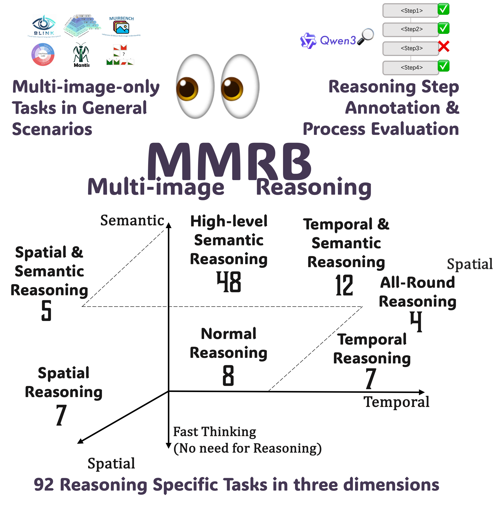
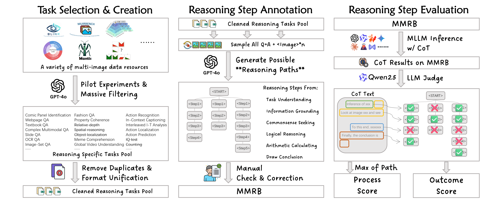

# MMRB: An MultiModal Multi-image Reasoning Benchmark

🌟 This is the official repository for the paper "[Evaluating MLLMs with Multimodal Multi-image Reasoning Benchmark](paper_link)".

[[🌐 HomePage](https://mmrb-benchmark.github.io/)] [[🤗Dataset](https://huggingface.co/)] [[📖 ArXiv Paper](paper_link)]

## 💥 News

## 👀 About MMRB

Multimodal Multi-image Reasoning Benchmark (MMRB), the first benchmark designed to evaluate structured visual reasoning across multiple images. MMRB consists of 4,750 samples encompassing 68,882 reasoning steps across 92 sub-tasks, covering semantic, spatial, and temporal reasoning.

<p align="center">
     <br>
  <b>Overview of the MMRB benchmark, which evaluates MLLMs on 92 multi-image-only sub-tasks annotated with reasoning steps.</b> 
</p>

## 🛠️ Data Construction Pipeline

1. **Task Selection & Creation**: We first surveyed 22 multi-image datasets and collected 242 tasks, then filtered and categorized them into semantic, temporal, and spatial reasoning types following the [MMIU](https://mmiu-bench.github.io/) taxonomy. Using ChatGPT-4o with chain-of-thought (CoT) prompting, we further selected 101 reasoning-focused tasks for annotation, excluding hard math problems to better target general multi-image understanding.
2. **Reasoning Steps Annotation**: For each multi-image reasoning task, we prompt GPT-4o to generate three diverse reasoning trajectories, each composed of step-by-step explanations. These steps are categorized into six types—**Task Understanding**, **Information Grounding**, **Commonsense Seeking**, **Logical Reasoning**, **Arithmetic Calculating**, and **Drawing Conclusion**—based on refined cognitive operations. This results in rich, multi-path annotated tasks that reflect varied reasoning strategies leading to the same answer.
3. **Manual Inspection and Correction**: To ensure annotation quality, we conducted a rigorous human verification process. A team of 17 trained annotators manually reviewed and corrected both reasoning steps and final answers generated by GPT-4o. In total, **25%** of samples had at least one reasoning step revised, and **7.5%** had their final answers corrected—highlighting the importance of human oversight in building a high-quality benchmark.

<p align="center">
     <br>
</p>

## 🏆 Leaderboard

The leaderboard is available [here](https://mmrb-benchmark.github.io/#leaderboard)

## 📁 Project Structure

```
MMRB/
├── data_download/                    # Data download related scripts
│   └── downloader.py                 # Dataset downloader
│
├── src/                              # Source code directory
│   ├── Annotation_Tool/              # Data annotation tool
│   ├── API_Model_Inference/          # API model inference related code
│   ├── Data_Construction/            # Data construction and processing scripts
│   ├── Evaluate/                     # model evaluation code
│   ├── Open_Source_Model_Inference/  # Open-source model inference and evaluation
│   └── Reward/                       # Reward model code
│
├── assets/                           # Project resource files (images)
└── README.md                         # Project documentation
```

## 🚀 Quick Start
```
pip install datasets
cd data_download
python downloader.py
```

## 📝 Citation